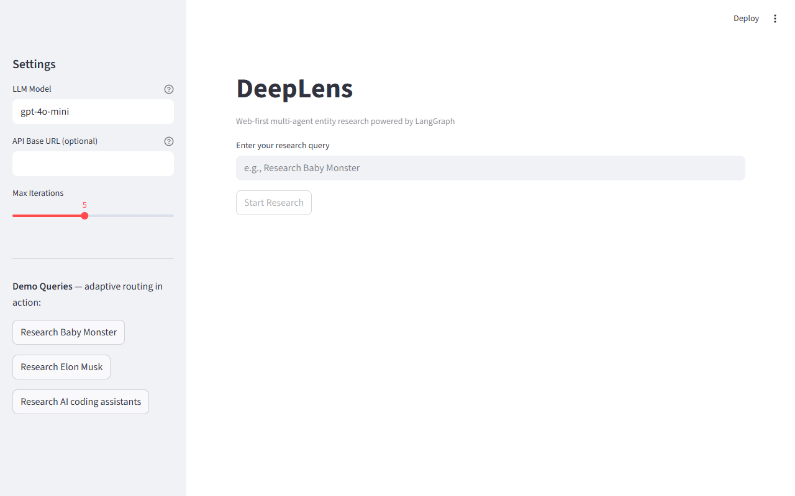
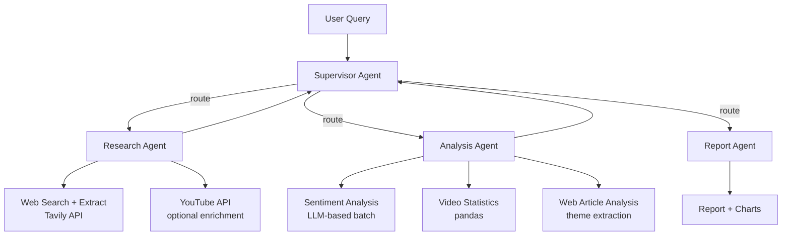
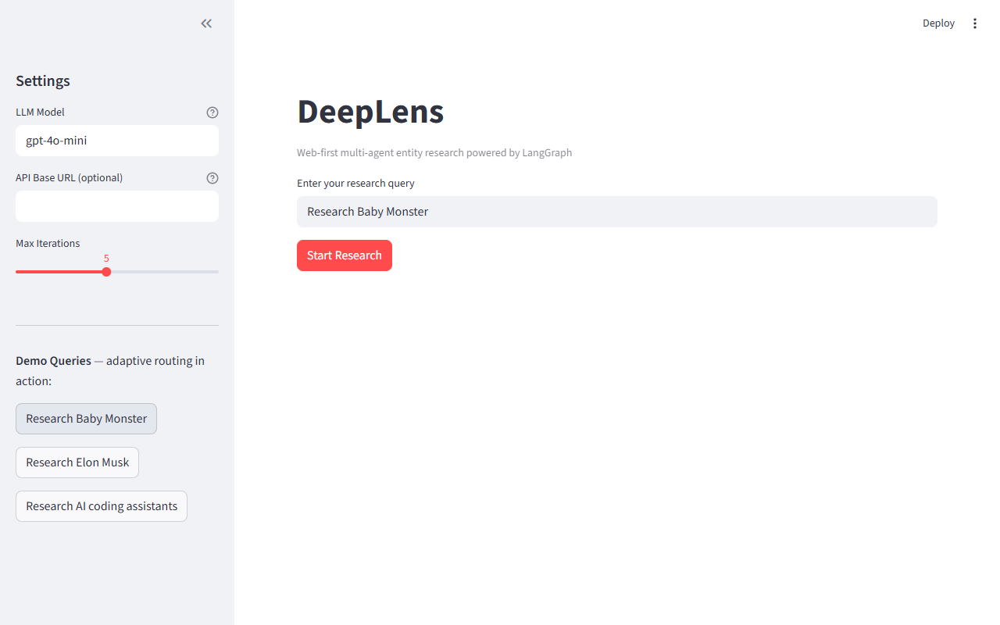

# DeepLens 🔍

> Web-first multi-agent entity research powered by LangGraph



Research any entity — artist, public figure, brand, or topic — and get a structured markdown report with analysis. Powered by a multi-agent LangGraph system where an adaptive supervisor routes between specialized agents.

---

## Features

- **Web-first architecture** — works with just OpenAI + Tavily keys. YouTube is optional enrichment.
- **Multi-angle search** — LLM generates 2–5 search queries from different angles (overview, news, opinion, controversy) per session, inspired by Perplexity
- **Deep extraction** — fetches full article content from top URLs via Tavily, not just snippets, inspired by Manus
- **Adaptive supervisor** — LLM decides routing based on information completeness, not a fixed pipeline
- **Entity-aware** — adapts research strategy for artists, public figures, companies, and topics
- **Optional YouTube enrichment** — video metrics + comments when `YOUTUBE_API_KEY` is set; gracefully skipped otherwise

---

## Architecture



### Supervisor Adaptive Routing

The supervisor is **not** a fixed pipeline. It makes context-dependent decisions:

- **First iteration**: routes to Research with entity-type-aware instructions
- **Non-linear loops**: routes back to Research if coverage is thin or contradictions found
- **YouTube enrichment**: only suggested for entities with strong YouTube presence (artists, creators, brands)
- **Web-only path**: if no YouTube API key, routes Research → Analysis → Report without YouTube steps

### Agent Roles

| Agent | Responsibility |
|---|---|
| **Supervisor** | LLM-based routing decisions using structured output |
| **Research** | Multi-angle web search, full URL extraction, optional YouTube enrichment |
| **Analysis** | LLM sentiment analysis (batch), pandas statistics, web theme extraction |
| **Report** | Matplotlib chart generation, structured markdown report |

---

## Quick Start

```bash
# 1. Clone
git clone https://github.com/kahwei-loo/deeplens.git
cd deeplens

# 2. Install (requires Python 3.11+)
pip install -e "."
# or with uv:
# uv pip install -e "."

# 3. Configure
cp .env.example .env
# Edit .env: add OPENAI_API_KEY + TAVILY_API_KEY

# 4a. Run via CLI
python -m deeplens "Research Baby Monster"
python -m deeplens "Research Elon Musk" --verbose

# 4b. Or launch the Streamlit UI
streamlit run app/streamlit_app.py
```

---

## Environment Variables

| Variable | Required | Description |
|---|---|---|
| `OPENAI_API_KEY` | **Yes** | OpenAI API key for all LLM calls |
| `TAVILY_API_KEY` | **Yes** | Tavily search and content extraction |
| `YOUTUBE_API_KEY` | No | YouTube video metrics + comments (optional enrichment) |
| `OPENAI_API_BASE` | No | Custom base URL (OpenRouter, Azure, local LLMs) |
| `MODEL_NAME` | No | LLM model name (default: `gpt-4o-mini`) |
| `MAX_ITERATIONS` | No | Max supervisor routing loops (default: `5`) |
| `OUTPUT_DIR` | No | Output directory for reports and charts (default: `output`) |

---

## Tech Stack

| Component | Technology |
|---|---|
| Agent orchestration | [LangGraph](https://github.com/langchain-ai/langgraph) — Supervisor pattern |
| Web search + extract | [Tavily API](https://tavily.com) — primary data source |
| LLM | [OpenAI API](https://platform.openai.com) — compatible with OpenRouter, Azure |
| Demo UI | [Streamlit](https://streamlit.io) |
| Statistics | pandas + matplotlib |

---

## API Usage & Costs

- **Tavily**: 1,000 searches/month on free tier. Budget ~5–15 searches per research query (multi-angle).
- **OpenAI**: Use `gpt-4o-mini` during development (~$0.01–0.05/query). Switch to `gpt-4o` for demos.
- **YouTube**: 10,000 units/day. Only consumed when `YOUTUBE_API_KEY` is configured.

---

## Screenshots

**Clean initial state** — sidebar settings + demo shortcuts:


**Query pre-filled** — "Start Research" activates when a query is entered:



---

## Sample Output

See a full example report generated by the DeepLens pipeline: **[Sample Report — BABYMONSTER](docs/sample-report.md)**

The report includes:
- Multi-angle web research across news, opinion, and community sources
- Structured sections: executive summary, key findings, public sentiment, and citations
- Representative comments from Reddit, Quora, and other platforms
- 25 cited sources with direct links

---

## Project Structure

```
deeplens/
├── src/deeplens/
│   ├── agents/
│   │   ├── supervisor.py   # LLM routing decisions
│   │   ├── research.py     # Web search + YouTube enrichment
│   │   ├── analysis.py     # Sentiment + statistics
│   │   └── report.py       # Chart generation + report writing
│   ├── tools/
│   │   ├── web_search.py   # Tavily multi-query search + extract
│   │   ├── youtube.py      # YouTube Data API v3
│   │   ├── sentiment.py    # LLM-based batch sentiment
│   │   ├── statistics.py   # pandas video statistics
│   │   └── chart.py        # matplotlib chart generation
│   ├── graph.py            # LangGraph StateGraph definition
│   ├── state.py            # DeepLensState TypedDict
│   ├── models.py           # Typed data models
│   └── config.py           # Pydantic settings
├── app/
│   └── streamlit_app.py    # Streamlit demo UI
├── tests/                  # 66 passing tests
├── docs/
│   └── PRD.md              # Full product requirements
└── .env.example
```

---

## License

MIT
